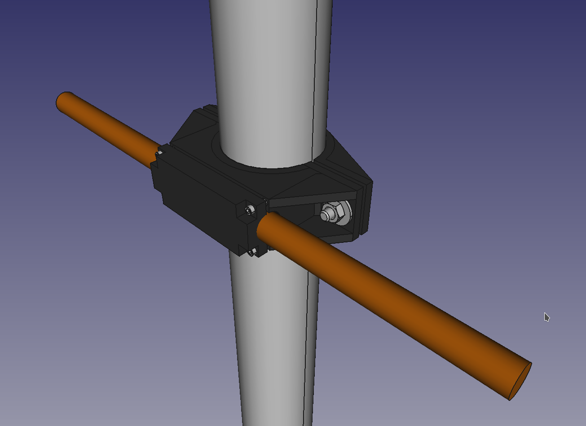

# pvc_mag_loop_Mechanicals_Dec2020

This project is a work in progress as of 12-8-2020!
* Only the bottom clamp has been designed so far

This project is a FreeCAD design that is creating mounting bracket for my amateur radio magnetic loop antenna. The project implements the following sized components:

* Copper Pipe = 0.5"
* PVC Pipe = Schedule 40 2"

The design is fixed to these dimensions. Future update(s) may look to make this more scalable within FreeCAD using parametric links.

